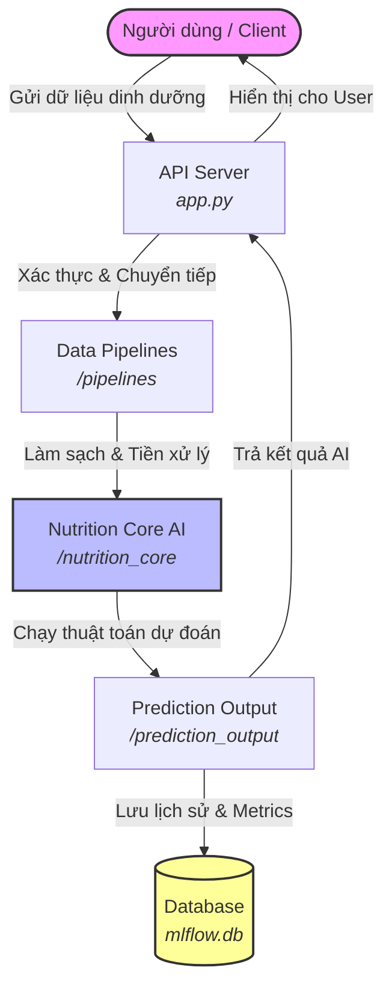

### Sơ đồ Luồng dữ liệu (Data Pipeline)

```mermaid
graph TD
    %% Khai báo các thành phần
    Client([Người dùng / Client])
    API[API Server <br/> <i>app.py</i>]
    Pipe[Data Pipelines <br/> <i>/pipelines</i>]
    Core[Nutrition Core AI <br/> <i>/nutrition_core</i>]
    Output[Prediction Output <br/> <i>/prediction_output</i>]
    DB[(Database <br/> <i>mlflow.db</i>)]

    %% Định nghĩa luồng xử lý
    Client -->|Gửi dữ liệu dinh dưỡng| API
    API -->|Xác thực & Chuyển tiếp| Pipe
    Pipe -->|Làm sạch & Tiền xử lý| Core
    Core -->|Chạy thuật toán dự đoán| Output
    Output -->|Lưu lịch sử & Metrics| DB
    Output -->|Trả kết quả AI| API
    API -->|Hiển thị cho User| Client

    %% Tùy chỉnh màu sắc để dễ nhìn
    style Client fill:#f9f,stroke:#333,stroke-width:2px
    style DB fill:#ff9,stroke:#333,stroke-width:2px
    style Core fill:#bbf,stroke:#333,stroke-width:2px
```
